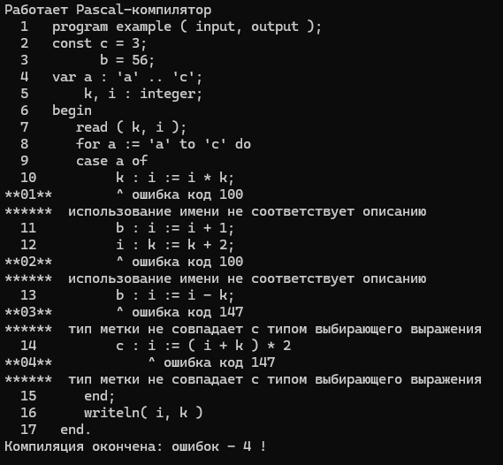
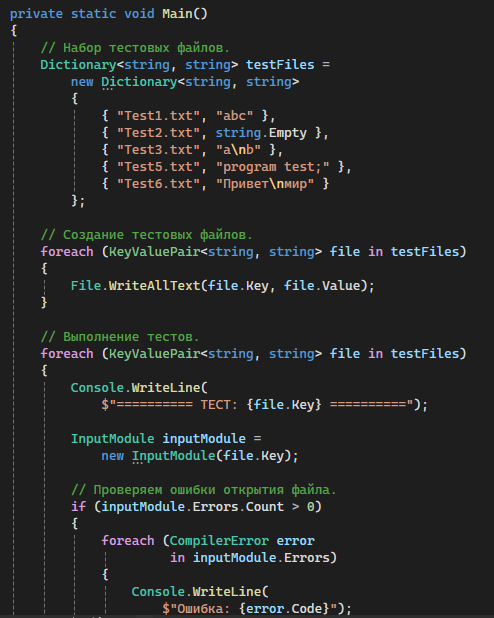
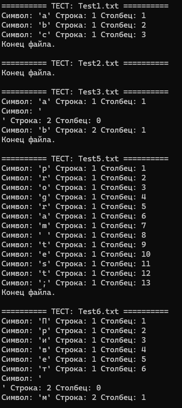

# Красных Александр ИТС-2 Лабораторная №10

# Задание 0

### Текст задачи

1. Опишите функцию nextch — модуль ввода-вывода. (Примечание: из-за отсутствия
анализатора, формирующего таблицу ошибок, создайте таблицу ошибок вручную.)
2. Разработайте набор тестов для тестирования модуля ввода-вывода.
3. Выполните тестирование модуля ввода-вывода.

### Алгоритм решения

1. Написать класс для посимвольного чтения файла, в моем программе он называется SourceReader и находится в файле InputOutput.cs. Механизм работы
функции прост: с помощью конструктора создается элемент класса. Далее методами NextChar и ReadNextLine осуществляется посимвольное и построчное считывание текста файла с последующим выходом методом close.
2. Написать класс содержащий и работающий со всеми ошибками под названием ErrorHandler. Создать в нем мнимую таблицу ошибок и несколько полей, свойств и методов для вывода и подсчета ошибок в коде.
3. Создать временный класс TestDriver для проведения дальнейших тестов элементов компилятора. В данном случае мы будет тестировать работу классов SourceReader и ErrorHadler на предмет корректной или некорретной работы этих классов. В нем в данный момент проводится считывание строк из файла и вывод сообщений об ошибках(мнимых)
в ходе выполнения программы. Пока что позиции где выводятся ошибки строго фиксированы и нужны лишь для теста правильно ли выводится ошибка.
4. Создать файл test.pas с небольшим паскальным кодом внутри который и будет обрабатывать наш модуль ввода-вывода и модуль ошибок.
5. Протестировать работу программы и чтение строк файла, а так же проверить корректный вывод ошибок.

### Тестирование

# Задание 1

### Текст задачи

Написать учебный лексический анализатор для стандарта языка Паскаль
Исходные данные:
Файл 1 – программа пользователя на стандарте языка Паскаль (возможно, с
ошибками). Например,
program a;
var var
const d = 10;
и т.д.
Результат:
Первый этап Файл 2 – коды символов программы из файла 1.
Например,
2 51 15 и т.д.
Второй этап написания лексического анализатора включает решение следующих
задач:
• для целых чисел добавить проверку, не выходит ли число за пределы
допустимого диапазона;
• для идентификаторов выполнять поиск по таблице ключевых слов.

### Алгоритм решения

1. Нам понадобится класс token который будет отвечать за генерацию токенов, а так же запоминание позиции этих самых токенов,
также он будет содержать в себе типы токенов, таких как: Ключевые слова, идентификаторы, операторы, разделители и т.п.
2. Также нам понадобится таблица ключевых слов ввиде класса SymbolTable, в нем просто будут содержаться таблица ключевых слов,
а также проверка на то является ли наше слово из программы ключевым.
3. Теперь приступаем за самое сложное: сам Лексический анализатор. Он должен проверять каждый символ файла на то, какому токену он соотвествует,
является ли ключевым словом языка, именно он отвечает за генерацию для нас файла с лексеммами(кодами каждого символа программы),
а также за проверку выхода за предел допустимого диапазона integer.
4. Финальным этапом для нас будет изменение файла test.py для проведения теперь уже новых тестов именно на корректную работу Лексического анализатора,
а также изменение нашего TestDrive класса для тех же целей.
5. Теперь запускаем нашу программу и проверяем все ли правильно работает.

### Тестирование

# Задание 3

### Текст задачи

Создайте собственные функции для выполнения основных операций над списками (добавление/
удаление/поиск элемента, сцепка двух списков, получение элемента по номеру).

### Алгоритм решения

1. Запрос вводных данных
2. Поочередное обращение к нижеописанным функциям
3. функция создания списка работает с помощью рекурсивного вызова самой себя до тех пор пока не будет введено пустое значение
4. функция добавления элемента в список создает другой список элементами которого является добавляемое значение + исходный список
5. функция удаления элемента работает на рекурсивном поиске искомого значения вызывая сама себя если значения не найдено заменяя исходный список на его хвост
6. функция сращивания списков использует встроенный функционал F# и сращивает 2 списка с помощью команды &
7. функция поиска по значению элемента работает через функционал сравнения паттерна match, она ищет совпадение пока не дойдет до конца списка либо не найдет само совпадение
8. функция поиска по индексу элемента выводит элемент с помощью свойства типа данных list - list.item
9. Проверка каждой написанной функции

### Тестирование

